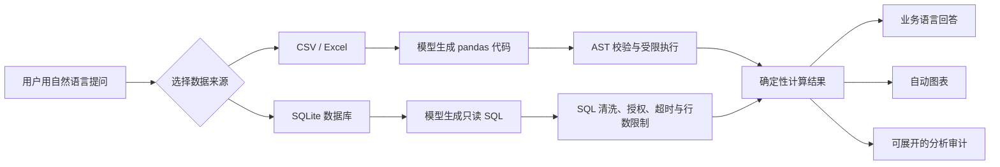

# 企业数据问答助手：从自然语言到可审计分析

这是我的核心 AI 应用作品。它面向企业数据分析场景，让用户用自然语言查询 CSV、Excel 或 SQLite 数据，同时保留生成逻辑、程序执行结果与最终回答，便于人工复核。

[返回作品集首页](../README.md)｜[查看运行说明](README.md)｜[查看主程序](app.py)

## 项目概览

| 项目项 | 内容 |
|---|---|
| 项目类型 | 个人作品集 / 企业数据智能原型 |
| 我的职责 | 需求拆解、交互设计、Python 开发、安全边界、测试、CI 与文档 |
| 技术栈 | Python、Streamlit、pandas、SQLite、Altair、OpenAI SDK、DeepSeek |
| 当前质量基线 | 91 项离线测试、Python 编译检查、GitHub Actions CI、无密钥启动检查 |

## 1. 业务问题

传统数据分析通常要求使用者掌握 pandas 或 SQL。直接让大模型读取整份数据并回答，又容易出现数值心算错误、字段理解偏差和结论无法追溯的问题。

这个项目的目标不是让模型代替计算程序，而是让模型负责生成分析逻辑，再由受控的 Python 或 SQLite 执行器完成计算。

最终输出同时包含业务回答、图表和分析过程。使用者可以核对模型生成了什么、程序算出了什么，以及回答如何从结果中得到。

## 2. 解决方案与用户流程



文件模式会先检查格式、体积、行列数量与字段质量。数据库模式会读取允许访问的表结构，再让模型基于真实字段生成 SQL。

两条链路最终汇合到同一结果层，由程序决定是否绘图，并把执行逻辑和结果预览写入对话审计记录。

## 3. 系统结构

```text
Streamlit UI (app.py)
        │
        ├── analysis_service.py ── 编排生成、执行与回答
        │       ├── ai_service.py
        │       ├── python_executor.py
        │       └── sql_executor.py
        │
        ├── data_quality.py ───── 文件校验与质量报告
        ├── database.py ───────── 数据库只读连接与元数据
        ├── data_management.py ── 演示数据的人工受控写入
        ├── chart_builder.py ───── 图表规则与交互
        ├── analysis_audit.py ──── 分析过程与结果预览
        ├── persistence.py ─────── 对话原子写入与损坏隔离
        ├── observability.py ───── 隐私友好的运行事件
        └── app_config.py ──────── 环境变量与运行路径
```

UI 只负责收集输入和展示状态。生成、执行、持久化、数据库访问和图表规则分别放在独立模块中，使关键逻辑可以脱离 DeepSeek 和浏览器进行测试。

## 4. 关键技术决策

### 模型生成逻辑，程序负责计算

模型不直接对整份数据进行心算。文件模式生成 pandas 代码，数据库模式生成 SQL；执行结果再交给模型翻译为业务语言，从结构上降低数值幻觉。

### 文件与数据库使用不同执行边界

pandas 代码会经过长度、AST 节点、函数和方法允许清单校验，并在原始 DataFrame 副本中执行。SQL 仅允许单条 `SELECT` 或 `WITH` 查询。

SQLite 连接开启只读模式和授权器，只允许访问当前选择的表。查询默认 3 秒超时，最多返回 200 行，避免无限递归或超大结果拖垮页面。

### 人工写入与 AI 查询分离

演示数据库支持人工新增、选择删除和恢复示例数据，但这些操作使用独立的参数化接口。AI 生成的 SQL 仍然无法执行 `INSERT`、`UPDATE`、`DELETE` 或 `DROP`。

删除操作会验证所有记录编号，并在单个事务中完成。任一记录失效时整批回滚，避免部分删除。

### 分析前先做数据质量检查

上传文件限制为 10 MB、10 万行和 100 个字段。系统会统计缺失值、重复行、字段类型和字段级缺失率，并阻断空数据、重复字段名和超限数据。

### 回答必须可追溯

每条分析回答都可以展开查看执行方式、生成的 pandas / SQL 逻辑和最多 20 行结果预览。审计记录会随聊天历史持久化，页面刷新后仍可核对。

## 5. 产品与交互迭代

图表并非模型直接决定，而是由结果结构触发规则：类别汇总使用柱状图，时间或数值序列使用折线图，多商品月度数据使用多序列折线图。

开发过程中，近重合折线点曾出现标签覆盖和悬停命中困难。我将永久标签改为局部提示，并让近重合点共享汇总信息，同时保留数据点的真实位置。

数据库管理被放在独立折叠区，并为删除和恢复操作增加确认状态。无 API Key 时仍能浏览和管理本地演示数据，但聊天输入会明确禁用。

## 6. 可靠性与可观测性

| 风险 | 处理方式 |
|---|---|
| API Key 缺失 | 进入无 AI 模式，保留数据浏览和管理能力 |
| 聊天 JSON 写入中断 | 临时文件 + 原子替换 |
| 历史 JSON 损坏 | 隔离为 `*.corrupt-*.json`，恢复空会话 |
| 查询过慢或结果过大 | SQL 超时与 200 行结果限制 |
| 内部异常暴露 | 用户友好错误文案 + 请求编号 |
| 日志泄露问题或数据 | JSON Lines 只记录状态、耗时、来源、结果规模和错误类别 |

这些措施用于提高作品集原型的可靠性，不代表受限 `exec` 已达到容器或操作系统级沙箱强度。

## 7. 自动化质量证据

当前测试套件包含 91 项离线测试，不调用 DeepSeek。覆盖范围包括：

- AI 提示词与服务编排
- SQL / Python 执行器及拒绝路径
- 数据接入与质量检查
- SQLite 表白名单与只读连接
- 演示数据新增、删除、事务回滚和恢复
- 图表类型与近重合点规则
- 对话持久化、损坏隔离、配置和安全错误文案
- 运行事件、示例库初始化和 Windows 启动脚本

GitHub Actions 会在项目文件发生推送或 Pull Request 时安装依赖、运行测试、编译 Python 模块、验证示例库，并执行无 API Key 的 Streamlit 健康检查。

## 8. 演示流程

1. 双击 `启动项目.bat` 或运行 `python -m streamlit run app.py`。
2. 进入数据库模式，查看 `sales` 表结构和数据预览。
3. 展开“管理演示数据”，展示人工写入与 AI 只读查询的分离。
4. 提问“各商品销售额的波动情况如何？”。
5. 查看多序列折线图，并测试近重合点提示。
6. 展开“分析过程”，核对 SQL、执行结果和最终回答。
7. 切换上传文件，使用 `sample_data.csv` 展示数据质量报告。

## 9. 关键文件

| 文件 | 作用 |
|---|---|
| [app.py](app.py) | Streamlit 页面与交互流程 |
| [analysis_service.py](analysis_service.py) | 文件和数据库分析用例编排 |
| [python_executor.py](python_executor.py) | pandas 代码校验与执行 |
| [sql_executor.py](sql_executor.py) | SQL 清洗、授权、超时与结果限制 |
| [data_quality.py](data_quality.py) | 上传限制与质量报告 |
| [data_management.py](data_management.py) | 演示数据人工增删和恢复 |
| [chart_builder.py](chart_builder.py) | 图表类型与交互规则 |
| [tests](tests/) | 91 项离线测试 |
| [project-03-ci.yml](../.github/workflows/project-03-ci.yml) | GitHub Actions 质量门禁 |

## 10. 已知边界与下一步

当前版本定位为单机单用户作品集和受控内部原型。生产化还需要用户身份、角色权限、外部业务数据库、租户数据隔离和更完整的操作审计。

Python 执行层仍属于进程内分层防护。面向不受信任公网用户时，应进一步使用独立进程、容器或专用计算服务隔离执行。

下一步可以扩展 PostgreSQL 数据源、指标语义层、查询成本控制、模型评估集和端到端链路追踪。

## 面试时的一句话介绍

我没有让大模型直接回答数据问题，而是让它生成受限的 pandas 或 SQL 逻辑，由程序完成确定性计算，再把结果、图表和分析过程一起交给用户核对。
